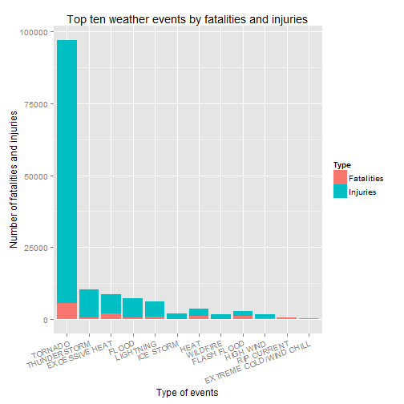
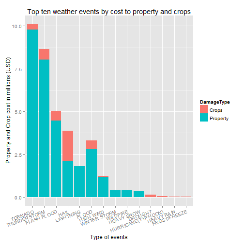

## Synopsis
This analysis of the U.S. National Oceanic and Atmospheric Administration's (NOAA) storm database was to determine which recorded weather event had the highest economic impact as well as public healt impact. The data analysed was collected from 1950-2011, though fewer events where collected in the earlier years all data was included in the study. 

The analysis found that Tornados are the biggest threat to both people and property. We also found that unlike property damage, the biggest threat to crops was Hail.  

## Data Processing

Start by loading in all the necessary packages used for this analysis

```r
library(stringr)    # for character manipulation and extraction
library(plyr)       # for ddply function
library(ggplot2)    # for graphics
library(datasets)   # for state abbreviations
```

### Read in data 
Download the bz2 compressed file from [here](https://d396qusza40orc.cloudfront.net/repdata%2Fdata%2FStormData.csv.bz2). Next read data into data frame using `read.csv` with `bzfile` to decompress

```r
stormdata <- read.csv(bzfile("StormData.csv.bz2"),header=T)
```


### Clean event data

```r
require(stringr)

# view unique categories in dataset
sort(unique(stormdata$EVTYPE),decreasing = F) 

# remove whitespace from begin/end, convert all to uppercase and remove symbols
stormdata$evtype_clean <- gsub("[^A-Z]", " ", gsub("^\\s+|\\s+$", "", toupper(stormdata$EVTYPE)))
stormdata$evtype_clean <- str_replace_all(stormdata$evtype_clean,pattern = "\\s+"," ")
stormdata$evtype_clean <- str_trim(stormdata$evtype_clean)

sort(unique(stormdata$evtype_clean),decreasing = F)

# Correct spelling errors such as AVALANCE/AVALANCHE and BEACH EROSIN/BEACH EROSION
stormdata$evtype_clean <- sub("AVALANCE","AVALANCHE",stormdata$evtype_clean)
stormdata$evtype_clean <- sub("BEACH EROSIN","BEACH EROSION",stormdata$evtype_clean)
stormdata$evtype_clean <- sub("HVY","HEAVY",stormdata$evtype_clean)
stormdata$evtype_clean <- sub("THUDERSTORM","THUNDERSTORM",stormdata$evtype_clean)
stormdata$evtype_clean <- sub("THUNDEERSTORM","THUNDERSTORM",stormdata$evtype_clean)
stormdata$evtype_clean <- sub("TUNDERSTORM WIND","THUNDERSTORM",stormdata$evtype_clean)
stormdata$evtype_clean <- sub("THUNERSTORM","THUNDERSTORM",stormdata$evtype_clean)
stormdata$evtype_clean <- sub("TORNDAO","TORNADO",stormdata$evtype_clean)
stormdata$evtype_clean <- sub("WAYTERSPOUT","WATERSPOUT",stormdata$evtype_clean)
stormdata$evtype_clean <- sub("FLOODING","FLOOD",stormdata$evtype_clean)
stormdata$evtype_clean <- sub("CSTL","COASTAL",stormdata$evtype_clean)
stormdata$evtype_clean <- sub("WND","WIND",stormdata$evtype_clean)
stormdata$evtype_clean <- sub("TSTM","THUNDERSTORM",stormdata$evtype_clean)

# Combine events into groups
stormdata$evtype_clean <- sub("^WINTER ST.*","WINTER STORM",stormdata$evtype_clean)
stormdata$evtype_clean <- sub("^WINTER WEAT.*","WINTER WEATHER",stormdata$evtype_clean)
stormdata$evtype_clean <- sub("^WINTER MIX","WINTER WEATHER",stormdata$evtype_clean)
stormdata$evtype_clean <- sub("^WINT(ER|R)Y.*","WINTER WEATHER",stormdata$evtype_clean)
stormdata$evtype_clean <- sub("^WILD.*","WILDFIRE",stormdata$evtype_clean)
stormdata$evtype_clean <- sub("WATERSPOUT TORNADO","TORNADO",stormdata$evtype_clean)
stormdata$evtype_clean <- sub("^WATER.*","WATERSPOUT",stormdata$evtype_clean)
stormdata$evtype_clean <- sub("VOLCANIC A.*","VOLCANIC ASHFALL",stormdata$evtype_clean)
stormdata$evtype_clean <- sub("^URBAN.*","URBAN FLOOD",stormdata$evtype_clean)
stormdata$evtype_clean <- sub("^UNSEASONA.*","UNSEASONAL WEATHER",stormdata$evtype_clean)
stormdata$evtype_clean <- sub("TROPICAL STORM.*","TROPICAL STORM",stormdata$evtype_clean)
stormdata$evtype_clean <- sub("^TORRENTIAL RAIN.*","TORRENTIAL RAIN",stormdata$evtype_clean)
stormdata$evtype_clean <- sub("^TORNADO.*","TORNADO",stormdata$evtype_clean)
stormdata$evtype_clean <- sub("^SUMMARY.*","SUMMARY",stormdata$evtype_clean)
stormdata$evtype_clean <- sub("^STRONG W.*","STRONG WINDS",stormdata$evtype_clean)
stormdata$evtype_clean <- sub("FLOOD FLASH FLOOD","FLASH FLOOD",stormdata$evtype_clean)
stormdata$evtype_clean <- sub("^THUND.*","THUNDERSTORM",stormdata$evtype_clean)
stormdata$evtype_clean <- sub("^(.*) THUNDERSTORM","THUNDERSTORM",stormdata$evtype_clean)
stormdata$evtype_clean <- sub("THUND.*","THUNDERSTORM",stormdata$evtype_clean)
stormdata$evtype_clean <- sub("^(FLASH|FLOOD) (FLO(O|OO)D|FLASH).*","FLASH FLOOD",stormdata$evtype_clean)
stormdata$evtype_clean <- sub("^FLOO(D|DS) .*","FLOOD",stormdata$evtype_clean)
stormdata$evtype_clean <- sub("^FLOODS","FLOOD",stormdata$evtype_clean)
stormdata$evtype_clean <- sub("^SLEET.*","SLEET",stormdata$evtype_clean)
stormdata$evtype_clean <- sub("^(.*) SLEET.*","SLEET",stormdata$evtype_clean)
stormdata$evtype_clean <- sub("^BEACH (EROSION COASTAL FLOOD|FLOOD)","COASTAL FLOOD",stormdata$evtype_clean)
stormdata$evtype_clean <- sub("^COASTAL (EROSION|TIDAL|SURGE|FLOOD).*","COASTAL FLOOD",stormdata$evtype_clean)
stormdata$evtype_clean <- sub("^COASTAL(EROSION|TIDAL|SURGE|FLOOD).*","COASTAL FLOOD",stormdata$evtype_clean)
stormdata$evtype_clean <- sub("^COASTALST.*","COASTAL STORM",stormdata$evtype_clean)
stormdata$evtype_clean <- sub("^(.*) COASTAL FLOOD","COASTAL FLOOD",stormdata$evtype_clean)
stormdata$evtype_clean <- sub("^BLIZZARD .*","BLIZZARD",stormdata$evtype_clean)
stormdata$evtype_clean <- sub("^(.*) BLIZZARD","BLIZZARD",stormdata$evtype_clean)
stormdata$evtype_clean <- sub("^EXTREME (WIND.*|COLD.*|RECORD).*","EXTREME COLD/WIND CHILL",stormdata$evtype_clean)
stormdata$evtype_clean <- sub("^SEVERE COLD","EXTREME COLD/WIND CHILL",stormdata$evtype_clean)
stormdata$evtype_clean <- sub("^(WIND|COLD) (CHILL.*|WIND.*).*","COLD/WIND CHILL",stormdata$evtype_clean)
stormdata$evtype_clean <- sub("^(.*) WIND CHILL.*","COLD/WIND CHILL",stormdata$evtype_clean)
stormdata$evtype_clean <- sub("^DROUGHT.*","DROUGHT",stormdata$evtype_clean)
stormdata$evtype_clean <- sub("^(.*) TORNADO","TORNADO",stormdata$evtype_clean)
stormdata$evtype_clean <- sub("^(FREEZE|FROST).*","FROST/FREEZE",stormdata$evtype_clean)
stormdata$evtype_clean <- sub("^(HURRICANE|TYPHOON).*","HURRICANE(TYPHOON)",stormdata$evtype_clean)
stormdata$evtype_clean <- sub("^FUNNE(L|LS).*","FUNNEL CLOUD",stormdata$evtype_clean)
stormdata$evtype_clean <- sub("^DUST DEV(I|E)L.*","DUST DEVIL",stormdata$evtype_clean)
stormdata$evtype_clean <- sub("^DUST ST.*","DUST STORM",stormdata$evtype_clean)
stormdata$evtype_clean <- sub("^DUSTST.*","DUST STORM",stormdata$evtype_clean)
stormdata$evtype_clean <- sub("^(.*) EXCESSIVE HEAT","EXCESSIVE HEAT",stormdata$evtype_clean)
stormdata$evtype_clean <- sub("^EXTREME HEAT","EXCESSIVE HEAT",stormdata$evtype_clean)
stormdata$evtype_clean <- sub("^HIGH SURF.*","HIGH SURF",stormdata$evtype_clean)
stormdata$evtype_clean <- sub("^HIGH WIND.*","HIGH WIND",stormdata$evtype_clean)
stormdata$evtype_clean <- sub("^HEAVY (RAIN.*|PRECI.*|SHOWE(R|RS))","HEAVY RAIN",stormdata$evtype_clean)
stormdata$evtype_clean <- sub("^HEAVY SNOW.*","HEAVY SNOW",stormdata$evtype_clean)
stormdata$evtype_clean <- sub("^(.*) HAIL","HAIL",stormdata$evtype_clean)
stormdata$evtype_clean <- sub("^HAIL.*","HAIL",stormdata$evtype_clean)
stormdata$evtype_clean <- sub("^HEAT.*","HEAT",stormdata$evtype_clean)
stormdata$evtype_clean <- sub("^RECORD (HIGH TEMPERATURE.*|WARM.*|HEAT.*)","HEAT",stormdata$evtype_clean)
stormdata$evtype_clean <- sub("^HIGH TEMPE.*","HEAT",stormdata$evtype_clean)
stormdata$evtype_clean <- sub("^HOT.*","HEAT",stormdata$evtype_clean)
stormdata$evtype_clean <- sub("^ICE STORM.*","ICE STORM",stormdata$evtype_clean)
stormdata$evtype_clean <- sub("LAKE FLOOD","LAKESHORE FLOOD",stormdata$evtype_clean)
stormdata$evtype_clean <- sub("^RIP CURRENT.*","RIP CURRENT",stormdata$evtype_clean)
stormdata$evtype_clean <- sub("^STORM SURGE.*","STORM SURGE/TIDE",stormdata$evtype_clean)
stormdata$evtype_clean <- sub("^LIG(H|N)TNING.*","LIGHTNING",stormdata$evtype_clean)
stormdata$evtype_clean <- sub("^(.*) LIG(H|N)TNING.*","LIGHTNING",stormdata$evtype_clean)
stormdata$evtype_clean <- sub("^LIGHTING.*","LIGHTNING",stormdata$evtype_clean)
stormdata$evtype_clean <- sub("^MUD S.*","MUDSLIDE",stormdata$evtype_clean)
stormdata$evtype_clean <- sub("^MUDS.*","MUDSLIDE",stormdata$evtype_clean)

# check changes
sort(unique(stormdata$evtype_clean),decreasing = F)
sort(table(stormdata$evtype_clean))
```

### Clean property and crop damage data
To be able to determine which of the events carries the most damage to property or/and crops we need to convert the `PROPDMGEXP` and `CROPDMGEXP` factors into the appropriate intergers. 
As the [documentation](https://d396qusza40orc.cloudfront.net/repdata%2Fpeer2_doc%2Fpd01016005curr.pdf) states the letters within the factor correspond to the following:

 * `h`= hundreds  = 100        = (2) 
 * `k`= thousands = 1000       = (3) 
 * `m`= millions  = 1000000    = (6) 
 * `b`= billions  = 1000000000 = (9)


```r
# convert in character and into lower letters
stormdata$PROPDMGEXP <- tolower(as.character(stormdata$PROPDMGEXP))
stormdata$CROPDMGEXP <- tolower(as.character(stormdata$CROPDMGEXP))

# convert to appropriate interger
stormdata$PROPDMGEXP[stormdata$PROPDMGEXP%in%c("+","-","?")] <- "1"
stormdata$PROPDMGEXP[stormdata$PROPDMGEXP%in%c("")] <- "0"
stormdata$PROPDMGEXP[stormdata$PROPDMGEXP%in%c("h")] <- "2"
stormdata$PROPDMGEXP[stormdata$PROPDMGEXP%in%c("k")] <- "3"
stormdata$PROPDMGEXP[stormdata$PROPDMGEXP%in%c("m")] <- "6"
stormdata$PROPDMGEXP[stormdata$PROPDMGEXP%in%c("b")] <- "9"

stormdata$CROPDMGEXP[stormdata$CROPDMGEXP%in%c("+","-","?")] <- "1"
stormdata$CROPDMGEXP[stormdata$CROPDMGEXP%in%c("")] <- "0"
stormdata$CROPDMGEXP[stormdata$CROPDMGEXP%in%c("h")] <- "2"
stormdata$CROPDMGEXP[stormdata$CROPDMGEXP%in%c("k")] <- "3"
stormdata$CROPDMGEXP[stormdata$CROPDMGEXP%in%c("m")] <- "6"
stormdata$CROPDMGEXP[stormdata$CROPDMGEXP%in%c("b")] <- "9"

# multiply the damage data with the new EXP into a new variable
stormdata$prop.damage <- as.numeric(stormdata$PROPDMGEXP)*stormdata$PROPDMG
stormdata$crop.damage <- as.numeric(stormdata$CROPDMGEXP)*stormdata$CROPDMG
```

### Clean dates 
Use the variable `BGN_DATE` to extract the `year` 

```r
stormdata$year <- as.numeric(format(as.Date(stormdata$BGN_DATE,"%m/%d/%Y"), "%Y"))
```


##  Data analysis
After data has been cleaned we need to prepare data for analysis. To obtain which event carries the highest cost to public health and the economy we need to sum up the injuries/fatalites/cost according the weather event. To do this  we first use `ddply` found in the `plyr` package. 

### Prepare data on population damage

```r
require(plyr)
# Create fatalities data
fatal_event<- ddply(stormdata, .(evtype_clean), 
                    summarize, 
                    fatalities=sum(FATALITIES,na.rm=T))

# Rename columns and create type variable
colnames(fatal_event) <- c("EventType","Count")
fatal_event$Type <- "Fatalities"

# Create injuries data
injur_event<- ddply(stormdata, .(evtype_clean), 
                    summarize, 
                    injuries=sum(INJURIES,na.rm=T))

# Rename columns and create type variable
colnames(injur_event) <- c("EventType","Count")
injur_event$Type <- "Injuries"

# Combine fatalities and injuries data - using only the top 10 in each group
population_damage <- rbind(fatal_event[order(fatal_event$Count,decreasing = T)[1:10],],
                         injur_event[order(injur_event$Count,decreasing = T)[1:10],])

# Reorder so plot are in decending order
population_damage$EventType <- reorder(population_damage$EventType,-population_damage$Count)
```

### Prepare data on economic damage

```r
require(plyr)
# Create property damage data
prop.dam_event <- ddply(stormdata, .(evtype_clean), 
                        summarize, 
                        prop.damage=sum(prop.damage,na.rm=T))

# Rename columns and create type variable
colnames(prop.dam_event) <- c("EventType","DamageDollars")
prop.dam_event$DamageType <- "Property"

# Create crops damage data
crop.dam_event <- ddply(stormdata, .(evtype_clean), 
                        summarize, 
                        crop.damage=sum(crop.damage,na.rm=T))

# Rename columns and create type variable
colnames(crop.dam_event) <- c("EventType","DamageDollars")
crop.dam_event$DamageType <- "Crops"

# Combine crops and property damage data - using only the top 10 in each group
economic_damage <- rbind(prop.dam_event[order(prop.dam_event$DamageDollars,decreasing = T)[1:10],],
                         crop.dam_event[order(crop.dam_event$DamageDollars,decreasing = T)[1:10],])

# Reorder so plot are in decending order
economic_damage$EventType <- reorder(economic_damage$EventType,-economic_damage$DamageDollars)
```

### Prepare damage data (population and economic) grouped by states
Restrict states to 50 states using `datasets` and `state.abb`. Restrict `EVTYPE` to only the top 10.

```r
require(datasets)
state_names <- data.frame(STATE = state.abb, State = state.name)

# Use EventType from population data to subset Events
STATE_50 <- subset(stormdata,stormdata$STATE %in% state_names$STATE & stormdata$evtype_clean%in%population_damage$EventType)
STATE_50$STATE <- droplevels(STATE_50$STATE)

# Use EventType from economic data to subset Events
STATE_50_prop <- subset(stormdata,stormdata$STATE %in% state_names$STATE & stormdata$evtype_clean%in%economic_damage$EventType)
STATE_50_prop$STATE <- droplevels(STATE_50_prop$STATE)
```

#### Population health - states with the highest fatalities and injuries
Prepare data using `ddply`

```r
pop_dam_state <- ddply(STATE_50, .(evtype_clean,STATE), 
                        summarize, 
                        fatalities=sum(FATALITIES,na.rm=T),
                        injuries=sum(INJURIES,na.rm=T))

# create subset using only the highest weather event == TORNADO
TORN <- subset(pop_dam_state,pop_dam_state$evtype_clean=="TORNADO")

# order by top ranking injuries
TORN <- TORN[order(TORN$injuries,decreasing = T)[1:10],]
TORN <- TORN[,c(2,4)]
row.names(TORN) <- NULL
colnames(TORN) <- c("State","Number of injuries")

# create subset using only the highest weather event == TORNADO
TORN2 <- subset(pop_dam_state,pop_dam_state$evtype_clean=="TORNADO")

# order by top ranking fatalities
TORN2 <- TORN2[order(TORN2$fatalities,decreasing = T)[1:10],]
TORN2 <- TORN2[,c(2:3)]
row.names(TORN2) <- NULL
colnames(TORN2) <- c("State","Number of fatalities")
```

#### Economic impact - states with the most damage cost


```r
eco_dam_state <- ddply(STATE_50_prop, .(evtype_clean,STATE), 
                        summarize, 
                        Property=sum(prop.damage,na.rm=T),
                        Crops=sum(crop.damage,na.rm=T))

# create subset using only the highest weather event == TORNADO
TORN3 <- subset(eco_dam_state,eco_dam_state$evtype_clean=="TORNADO")

# order by top ranking prop cost
TORN3 <- TORN3[order(TORN3$Property,decreasing = T)[1:10],]
TORN3 <- TORN3[,c(2:3)]
row.names(TORN3) <- NULL
colnames(TORN3) <- c("State","Property damage in $")
TORN3[2] <- format(TORN3[2],big.mark = ",")

# create subset using only the highest weather event == HAIL
HAIL <- subset(eco_dam_state,eco_dam_state$evtype_clean=="HAIL")

# order by top ranking prop cost
HAIL <- HAIL[order(HAIL$Crops,decreasing = T)[1:10],]
HAIL <- HAIL[,c(2,4)]
row.names(HAIL) <- NULL
colnames(HAIL) <- c("State","Crop damage in $")
HAIL[2] <- format(HAIL[2],big.mark = ",")
```

## Results
### Question 1: Across the United States, which types of events (as indicated in the `EVTYPE` variable) are most harmful with respect to population health?


```r
require(ggplot2)
 
ggplot(population_damage,aes(EventType, Count))+
        geom_bar(aes(fill=Type),stat = "identity")+              # set bar chart 
        theme(axis.text.x=element_text(angle=20, hjust=1))+      # set axis labels 
        labs(x="Type of events",                                 # label X axis
             y="Number of fatalities and injuries",              # label Y axis
             title="Top ten weather events by fatalities and injuries")
```

 

Figure 1 show us that `Tornados` are the biggest threat to the population, both in `injuries` and `fatalites`. The second biggest threat in regards to injuries are `Thunderstorms`. The second biggest killer is `Excessive Heat`.  

#### See which state has the highest injury & fatalities 


```r
require(xtable)
torn_tab <- xtable(TORN,align = "rcr",digits = 0 )
print(torn_tab,type="html",include.rownames=FALSE)
```

<!-- html table generated in R 3.1.0 by xtable 1.7-3 package -->
<!-- Fri Jul 25 19:05:32 2014 -->
<TABLE border=1>
<TR> <TH> State </TH> <TH> Number of injuries </TH>  </TR>
  <TR> <TD align="center"> TX </TD> <TD align="right"> 8207 </TD> </TR>
  <TR> <TD align="center"> AL </TD> <TD align="right"> 7929 </TD> </TR>
  <TR> <TD align="center"> MS </TD> <TD align="right"> 6246 </TD> </TR>
  <TR> <TD align="center"> AR </TD> <TD align="right"> 5116 </TD> </TR>
  <TR> <TD align="center"> OK </TD> <TD align="right"> 4829 </TD> </TR>
  <TR> <TD align="center"> TN </TD> <TD align="right"> 4748 </TD> </TR>
  <TR> <TD align="center"> OH </TD> <TD align="right"> 4442 </TD> </TR>
  <TR> <TD align="center"> MO </TD> <TD align="right"> 4330 </TD> </TR>
  <TR> <TD align="center"> IN </TD> <TD align="right"> 4224 </TD> </TR>
  <TR> <TD align="center"> IL </TD> <TD align="right"> 4145 </TD> </TR>
   </TABLE>

Table 1 takes a closer look at `Tornados` and we can see that the highest number of injuries during Tornados can be found in the state of `Texas` followed by `Alabama` and `Mississippi`.  


```r
torn2_tab <- xtable(TORN2,align = "rcr",digits = 0)
print(torn2_tab,type="html",include.rownames=FALSE)
```

<!-- html table generated in R 3.1.0 by xtable 1.7-3 package -->
<!-- Fri Jul 25 19:05:32 2014 -->
<TABLE border=1>
<TR> <TH> State </TH> <TH> Number of fatalities </TH>  </TR>
  <TR> <TD align="center"> AL </TD> <TD align="right"> 617 </TD> </TR>
  <TR> <TD align="center"> TX </TD> <TD align="right"> 538 </TD> </TR>
  <TR> <TD align="center"> MS </TD> <TD align="right"> 450 </TD> </TR>
  <TR> <TD align="center"> MO </TD> <TD align="right"> 388 </TD> </TR>
  <TR> <TD align="center"> AR </TD> <TD align="right"> 379 </TD> </TR>
  <TR> <TD align="center"> TN </TD> <TD align="right"> 368 </TD> </TR>
  <TR> <TD align="center"> OK </TD> <TD align="right"> 296 </TD> </TR>
  <TR> <TD align="center"> IN </TD> <TD align="right"> 252 </TD> </TR>
  <TR> <TD align="center"> MI </TD> <TD align="right"> 243 </TD> </TR>
  <TR> <TD align="center"> KS </TD> <TD align="right"> 236 </TD> </TR>
   </TABLE>

Table 2 shows us that the same three states are in the top 3 spots for Tornado fatalities, though the order has changed. The higest fatalities are in the state of `Alabama` followed by `Texas` and `Mississippi`.

### Question 2: Across the United States, which types of events have the greatest economic consequences?

```r
require(ggplot2)
 
ggplot(economic_damage,aes(EventType, DamageDollars/1000000))+
        geom_bar(aes(fill=DamageType),stat = "identity")+              # set bar chart 
        theme(axis.text.x=element_text(angle=20, hjust=1))+            # set axis labels 
        labs(x="Type of events",                                       # label X axis
             y="Property and Crop cost in millions (USD)",             # label Y axis
             title="Top ten weather events by cost to property and crops")
```

 

Figure 2 show us that `Tornados` also incure the highest cost of `property damage`. When we look at the weather event that incures the most cost to crops we can see that the highest cost of `crops damage` is `Hail`. 

#### See which state has the most cost to property and crops 


```r
require(xtable)
torn3_tab <- xtable(TORN3,align = "rcr",digits = 0 )
print(torn3_tab,type="html",include.rownames=FALSE)
```

<!-- html table generated in R 3.1.0 by xtable 1.7-3 package -->
<!-- Fri Jul 25 19:05:32 2014 -->
<TABLE border=1>
<TR> <TH> State </TH> <TH> Property damage in $ </TH>  </TR>
  <TR> <TD align="center"> TX </TD> <TD align="right"> 859,616 </TD> </TR>
  <TR> <TD align="center"> MS </TD> <TD align="right"> 571,793 </TD> </TR>
  <TR> <TD align="center"> AL </TD> <TD align="right"> 514,438 </TD> </TR>
  <TR> <TD align="center"> OK </TD> <TD align="right"> 504,815 </TD> </TR>
  <TR> <TD align="center"> FL </TD> <TD align="right"> 487,567 </TD> </TR>
  <TR> <TD align="center"> GA </TD> <TD align="right"> 463,387 </TD> </TR>
  <TR> <TD align="center"> IA </TD> <TD align="right"> 462,688 </TD> </TR>
  <TR> <TD align="center"> KS </TD> <TD align="right"> 437,217 </TD> </TR>
  <TR> <TD align="center"> MO </TD> <TD align="right"> 402,302 </TD> </TR>
  <TR> <TD align="center"> LA </TD> <TD align="right"> 397,877 </TD> </TR>
   </TABLE>

Table 3 takes a closer look at `Tornados` and we can see that the most cost to property during Tornados can be found in the state of `Texas` followed by `Mississippi` and `Alabama`. 


```r
hail_tab <- xtable(HAIL,align = "rcr",digits = 0)
print(hail_tab,type="html",include.rownames=FALSE)
```

<!-- html table generated in R 3.1.0 by xtable 1.7-3 package -->
<!-- Fri Jul 25 19:05:32 2014 -->
<TABLE border=1>
<TR> <TH> State </TH> <TH> Crop damage in $ </TH>  </TR>
  <TR> <TD align="center"> NE </TD> <TD align="right"> 604,976 </TD> </TR>
  <TR> <TD align="center"> TX </TD> <TD align="right"> 312,902 </TD> </TR>
  <TR> <TD align="center"> KS </TD> <TD align="right"> 242,739 </TD> </TR>
  <TR> <TD align="center"> IA </TD> <TD align="right"> 144,369 </TD> </TR>
  <TR> <TD align="center"> ND </TD> <TD align="right">  86,929 </TD> </TR>
  <TR> <TD align="center"> MN </TD> <TD align="right">  46,355 </TD> </TR>
  <TR> <TD align="center"> NY </TD> <TD align="right">  37,577 </TD> </TR>
  <TR> <TD align="center"> SD </TD> <TD align="right">  35,338 </TD> </TR>
  <TR> <TD align="center"> WI </TD> <TD align="right">  28,279 </TD> </TR>
  <TR> <TD align="center"> CO </TD> <TD align="right">  19,531 </TD> </TR>
   </TABLE>

In table 4 we see that the most cost during hail can be found in the state of `Nebraska` follwed by `Texas` and `Kansas`
